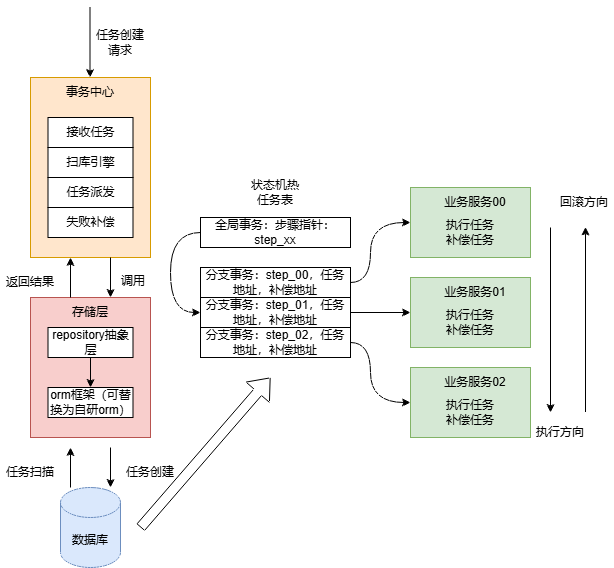

------

# 项目名称

## My-TX-Center：基于自研 ORM 的 Saga 分布式事务编排中心

------

## 一、项目背景

在微服务架构下，传统本地事务无法跨服务保证一致性。
为解决跨服务数据一致性问题，本项目实现了一套：

- 基于 Saga 模式的分布式事务编排中心
- 支持 Action / Compensation 双阶段机制
- 支持失败重试 + 指数退避
- 支持幂等控制
- 支持多实例 worker 抢占执行
- 支持状态持久化
- 支持可观测日志查询

同时，底层存储层基于本人自研 MyBatis 框架实现，
实现了完整的 ORM 执行流程与插件扩展机制。

------

# 二、整体架构




```
┌───────────────────────────┐
│       Client/Demo         │
└─────────────┬─────────────┘
              │
              ▼
┌───────────────────────────┐
│        tx-server          │
│  - SagaEngine             │
│  - HttpStepExecutor       │
│  - TxWorker               │
└─────────────┬─────────────┘
              │
              ▼
┌───────────────────────────┐
│        tx-store           │
│  Repository 抽象层         │
│  MyBatis 实现              │
│  (可替换为自研 ORM)         │
└─────────────┬─────────────┘
              │
              ▼
         MySQL 数据库
```

------

# 三、Saga 事务中心功能

###  Saga 状态机

支持事务状态流转：

```
INIT → RUNNING → DONE
             ↘
          COMPENSATING → COMPENSATED
```

------

###  持久化设计

三张核心表：

- tx_global：全局事务状态
- tx_step：步骤状态
- tx_log：执行日志

支持：

- 当前步骤指针
- retry 次数
- 错误记录
- version 乐观锁字段

------

###  Worker 推进机制

- 定时扫描 next_run_at
- 支持指数退避（2s / 4s / 8s / 16s）
- 支持人工 retry
- 支持人工 compensate
- 支持多实例抢占（基于 version 乐观锁）

------

###  HTTP 调用层

基于 OkHttp 实现：

- 连接池
- 超时控制（动态覆盖 timeoutMs）
- 4xx / 5xx 错误分类
- 网络异常可重试
- 日志记录

------

###  幂等机制

业务侧实现：

- DB 唯一索引幂等表
- txId + step + phase + endpoint 唯一
- 避免重复扣库存 / 扣款

------

###  可观测性

- 查询事务详情接口
- 查询 step 状态
- 查询执行日志
- 查看 retry 情况

------

# 四、自研 MyBatis 框架能力

本项目底层 ORM 由本人实现，核心功能包括：

------

##  核心执行流程

```
SqlSession
   ↓
Executor
   ↓
StatementHandler
   ↓
ParameterHandler
   ↓
PreparedStatement
   ↓
ResultSetHandler
```

实现：

- 预编译语句处理
- 参数绑定
- 结果映射
- 返回类型适配
- 支持接口代理 Mapper

------

##  插件体系（重点亮点）

实现类似 MyBatis 的插件机制：

- 基于注解声明拦截目标
- 动态代理构建责任链
- 多插件链式增强
- 插件顺序可控

支持插件功能：

- SQL 日志插件
- 慢 SQL 监控
- 二级缓存插件（装饰器实现）
- 执行耗时统计

------

##  缓存机制

- 一级缓存（SqlSession 级）
- 二级缓存（装饰器模式）
- 重复读事务测试

------

##  XML 解析

支持：

- mapper.xml 解析
- sql 节点解析
- ${} 参数解析
- OGNL 表达式支持
- 动态 SQL 组装

------

##  事务管理

- JDBC 原生事务实现
- Spring 事务集成
- DataSource 管理
- 数据库连接池

------

# 五、技术亮点总结

- 手写 ORM 框架（完整执行链）
- 插件责任链模式
- 装饰器实现二级缓存
- Saga 状态机设计
- 指数退避算法
- 乐观锁抢占
- 幂等表设计
- HTTP 错误分类
- Worker 扫描调度模型

------

# 六、项目难点

1. 状态机与数据库一致性保证
2. 多实例并发抢占
3. 插件责任链设计
4. 动态 SQL 解析与执行
5. 事务与缓存一致性

------

